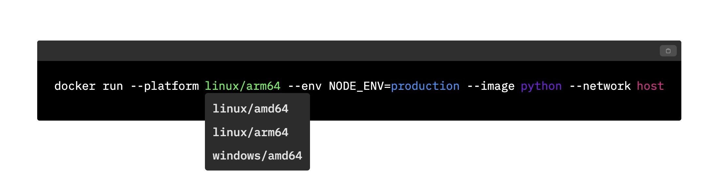
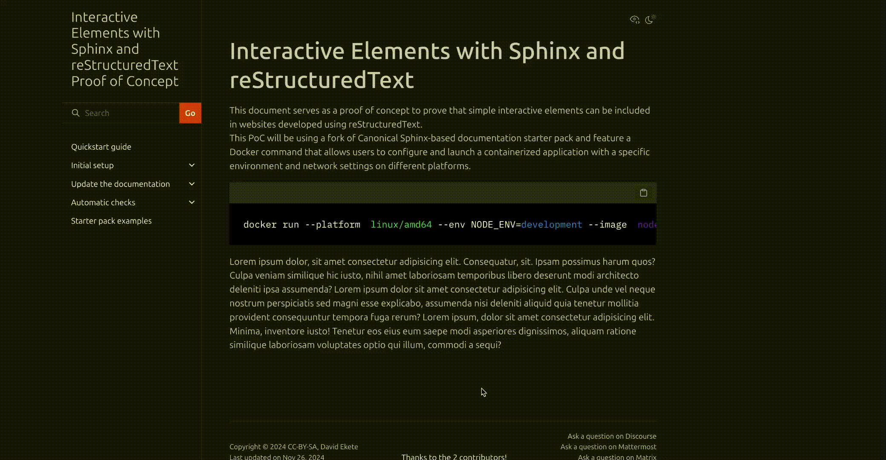

Generic Sphinx-RST: PoC for including interactive elements in RST using JavaScript
==================================================================================

This document serves as a proof of concept to prove that simple
interactive elements can be included in websites developed using
reStructuredText.

This PoC will uses a fork of Canonical’s Sphinx-based documentation
starter pack and features a Docker command that allows users to
configure and launch a containerized application with a specific
environment and network settings on different platforms.


Interactive Element
-------------------

The interactive element for this PoC will be a dynamic code block that
allows you to change the varying parts of the docker command, such as
the platform, through a dropdown interface.

Here's the Docker command:

.. code:: docker

   docker run --platform linux/amd64 --env NODE_ENV=development --image node --network bridge

The element is shown in the image below:




Implementing the Interactive Element in RST
-------------------------------------------

To implement the interactive element described above, you will use the
RST ``raw`` directive. The ``raw`` directive allows you to include raw
content in a different format, such as HTML, in your RST page. Content
included in the ``raw`` directive will not be processed by the RST
parser and, as such, is rendered on the page directly.

First, you will implement your interactive element using HTML, CSS, and
JavaScript, as described above. The interactive element’s HTML, CSS, and
JavaScript files are in this
`Codepen <https://codepen.io/david_ekete/pen/KwPPjQG>`__.

After creating your source files, you need to add them to the
appropriate folders. Using Canonical’s documentation starter pack’s
convention, the CSS files should be in the
``sp-files/.sphinx/_static/css`` directory. The JavaScript files should
be in the ``sp-files/.sphinx/_static/scripts`` directory. The
``scripts`` directory does not exist by default; you have to create it.

Next, register your CSS and JavaScript files in your
```conf.py`` file. In your ``conf.py`` file, you
should see a ``html_css_files`` and ``html_js_files`` array. Add the
file path of your CSS file relative to the ``_static`` folder to the
``html_css_files`` array and do the same for your JavaScript file in the
``html_js_files`` array.

.. code:: python

   #sp-files/conf.py
   ...
   # Adds custom CSS files, located under 'html_static_path'

   html_css_files = [
       "css/pdf.css",
       "css/styles.css" # add this line
   ]

   # Adds custom JavaScript files, located under 'html_static_path'

   html_js_files = [
       "scripts/snippet.js" # add this line
   ]

Finally, you can include the HTML file in the same directory as the
pages you want to add the interactive element to.

Adding the interactive element to a page
----------------------------------------

To add the interactive element to a page, declare the ``raw`` directive
and specify ``html`` as the output format. Then specify the ``:file:``
option and pass the relative path to the HTML file to be embedded.

For example:

.. code:: reStructuredText

   .. raw:: html
      :file: ./snippet.html

You can view the documentation page with the embedded interactive
element when you ``cd`` into the ``sp-docs`` directory and run the
command below:

.. code:: python

   make run

The results:
